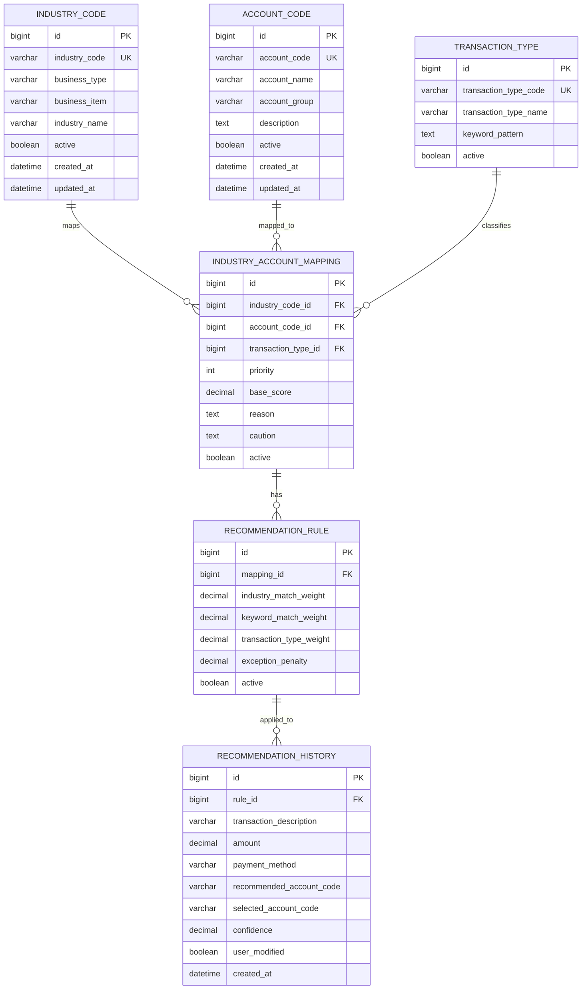
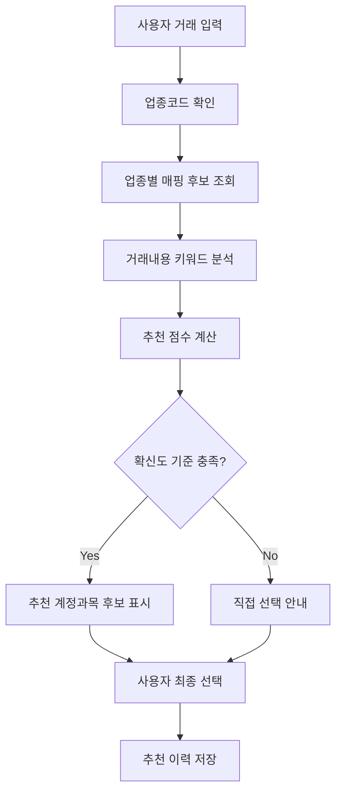

# hometax-industry-account-mapping

사업자등록 업종 정보를 활용한 홈택스 계정과목 추천 기능 개선 제안입니다.  
A public service improvement proposal for industry-based account category recommendations in Hometax.

---

## Preview

브라우저 미리보기 화면은 아래 주소에서 확인할 수 있습니다.

[Preview 바로가기](http://code88morning-cmd.github.io/hometax-industry-account-mapping/preview.html)

> 미리보기 화면에서는 업종 선택, 거래내용 입력, 거래금액 입력, 결제수단 선택 후 추천 계정과목 후보와 추천 사유를 확인할 수 있습니다.

---

## 1. 프로젝트 개요

이 레포는 단순 개발 연습용 레포가 아니라, 홈택스의 장부 작성 UX를 개선하기 위한 **공공서비스 개선 제안형 데이터 매핑 설계 레포**입니다.

핵심 아이디어는 다음과 같습니다.

> 사업자등록 단계에서 이미 수집된 업종코드, 업태, 종목 정보를 장부 작성 단계와 연결하여 사용자가 계정과목을 더 쉽게 선택하도록 돕는다.

즉, 이 프로젝트는 **업종 정보와 회계 계정과목을 연결하는 추천 규칙, 데이터 구조, API 응답 예시, UX 흐름**을 제안합니다.

---

## 2. 문제 정의

홈택스는 사업자등록, 업종코드 조회, 세금 신고, 간편장부 작성 안내 등 다양한 기능을 제공합니다.  
하지만 개인사업자가 실제 장부를 작성할 때는 거래내용에 맞는 계정과목을 직접 판단해야 하는 경우가 많습니다.

특히 초보 개인사업자는 다음과 같은 문제를 겪을 수 있습니다.

- 같은 지출이라도 업종에 따라 계정과목 판단이 달라질 수 있음
- 광고비, 수수료, 운반비, 소모품비, 통신비 등을 구분하기 어려움
- 홈택스에 이미 등록된 업종 정보가 장부 입력 단계에서 충분히 활용되지 않음
- 계정과목 선택 오류가 장부 품질과 신고 부담으로 이어질 수 있음
- 간편장부 사용자가 세무 용어를 이해하지 못해 입력을 포기하거나 세무대리인에게 의존하게 됨

---

## 3. 제안 방향

본 프로젝트는 홈택스 장부 입력 화면에서 아래와 같은 추천 흐름을 제안합니다.

```text
사업자등록 업종 정보
        ↓
업종코드 / 업태 / 종목 확인
        ↓
업종별 자주 쓰는 계정과목 후보 조회
        ↓
거래내용, 거래유형, 결제수단과 비교
        ↓
추천 계정과목 후보와 추천 사유 표시
        ↓
사용자가 최종 선택 또는 수정
        ↓
선택 이력을 추천 품질 개선 데이터로 저장
```

예시는 다음과 같습니다.

| 업종 | 거래내용 | 추천 계정과목 | 추천 사유 |
|---|---|---|---|
| 전자상거래 소매업 | 네이버 스마트스토어 광고비 | 광고선전비 | 온라인 판매 촉진 목적의 광고 지출 |
| 전자상거래 소매업 | 택배 발송비 | 운반비 | 상품 배송과 직접 관련된 비용 |
| 음식점업 | 식재료 구매 | 원재료비 | 음식 제조를 위한 주요 재료 구매 |
| 소프트웨어 개발업 | 클라우드 서버 이용료 | 지급수수료 / 통신비 | 서비스 운영을 위한 외부 플랫폼·인프라 비용 |
| 교육서비스업 | 강의장 대관료 | 지급임차료 | 교육 제공을 위한 공간 사용 비용 |

---

## 4. 기대 효과

| 대상 | 기대 효과 |
|---|---|
| 개인사업자 | 계정과목 선택 부담 감소, 장부 작성 시간 단축 |
| 초보 사업자 | 세무 용어 이해 없이도 추천 사유를 보고 선택 가능 |
| 홈택스 | 장부 입력 UX 개선, 입력 오류 감소, 신고 품질 향상 |
| 세무대리인 | 반복적인 계정과목 문의 감소, 검토 업무 효율화 |
| 공공서비스 관점 | 이미 보유한 사업자등록 데이터를 신고·장부 단계에 재활용 |

---

## 5. 포함 자료

```text
hometax-industry-account-mapping/
├─ README.md
├─ preview.html
├─ preview/
│  └─ preview.html
├─ data/
│  ├─ industry-code-sample.csv
│  ├─ account-code-sample.csv
│  └─ industry-account-mapping-sample.csv
├─ docs/
│  ├─ recommendation-rule.md
│  ├─ erd.md
│  ├─ api-spec.md
│  ├─ batch-design.md
│  └─ ux-flow.md
├─ examples/
│  ├─ input-example.json
│  └─ output-example.json
└─ src/
   └─ example-architecture/
      ├─ dto/
      ├─ service/
      ├─ mapper/
      └─ scheduler/
```

현재 레포가 문서 중심이라면 `src/example-architecture`는 실제 구현 전 **권장 구조 예시**로 둘 수 있습니다.

---

## 6. 주요 파일 설명

| 파일 | 설명 |
|---|---|
| `preview.html` | 브라우저에서 바로 열 수 있는 추천 기능 미리보기 화면 |
| `data/industry-code-sample.csv` | 데모용 업종코드, 업태, 종목 샘플 |
| `data/account-code-sample.csv` | 데모용 계정과목 코드와 설명 |
| `data/industry-account-mapping-sample.csv` | 업종별 거래유형과 추천 계정과목 매핑 데이터 |
| `docs/recommendation-rule.md` | 추천 점수 산정 방식, 예외처리, 사용자 안내 문구 |
| `docs/erd.md` | 업종코드, 계정과목, 추천 규칙, 이력 테이블 관계 설명 |
| `docs/api-spec.md` | 계정과목 추천 API 요청/응답 명세 |
| `docs/batch-design.md` | 업종코드 및 계정과목 기준 데이터 적재 방식 |
| `docs/ux-flow.md` | 홈택스 장부 입력 화면 기준 사용자 흐름 |
| `examples/input-example.json` | 계정과목 추천 API 요청 예시 |
| `examples/output-example.json` | 계정과목 추천 API 응답 예시 |

---

## 7. CSV 샘플 데이터

### 7.1 업종코드 샘플

`data/industry-code-sample.csv`

| 컬럼 | 설명 |
|---|---|
| `industry_code` | 데모용 업종코드 |
| `business_type` | 업태 |
| `business_item` | 종목 |
| `industry_name` | 업종명 |
| `description` | 업종 설명 |

### 7.2 계정과목 샘플

`data/account-code-sample.csv`

| 컬럼 | 설명 |
|---|---|
| `account_code` | 데모용 계정과목 코드 |
| `account_name` | 계정과목명 |
| `account_group` | 비용, 매출, 자산 등 분류 |
| `description` | 계정과목 설명 |
| `example_keywords` | 추천에 사용할 수 있는 예시 키워드 |

### 7.3 업종-계정과목 매핑 샘플

`data/industry-account-mapping-sample.csv`

| 컬럼 | 설명 |
|---|---|
| `industry_code` | 데모용 업종코드 |
| `industry_name` | 업종명 |
| `transaction_type` | 거래유형 |
| `recommended_account` | 추천 계정과목 |
| `priority` | 추천 우선순위 |
| `reason` | 추천 사유 |
| `caution` | 주의사항 |

---

## 8. 추천 규칙 요약

추천 로직은 다음 기준을 조합합니다.

```text
추천점수 = 업종 일치 점수 + 거래 키워드 점수 + 거래유형 점수 - 예외 위험 점수
```

| 평가 항목 | 예시 점수 |
|---|---:|
| 업종코드 일치 | +0.40 |
| 거래 키워드 일치 | +0.35 |
| 거래유형 일치 | +0.20 |
| 예외 가능성 존재 | -0.10 |

추천 등급은 다음과 같이 구분합니다.

| 점수 | 등급 | 의미 |
|---:|---|---|
| 0.85 이상 | 높음 | 1순위 추천 |
| 0.70 이상 | 보통 | 후보 추천 |
| 0.70 미만 | 낮음 | 참고 후보 또는 미추천 |

자세한 내용은 `docs/recommendation-rule.md`를 참고합니다.

---

## 9. ERD

이 프로젝트의 핵심은 `업종코드`와 `계정과목`을 직접 1:1로 묶는 것이 아니라, **거래유형과 추천 규칙을 중간에 둔 N:M 매핑 구조**로 설계하는 것입니다.



---

## 10. 데이터베이스 설계 의도

| 테이블 | 역할 |
|---|---|
| `industry_code` | 사업자등록 업종코드, 업태, 종목, 업종명 관리 |
| `account_code` | 계정과목 코드, 계정과목명, 비용/매출/자산 구분 관리 |
| `transaction_type` | 광고비, 배송비, 식재료 구매 등 거래유형 관리 |
| `industry_account_mapping` | 업종별 추천 계정과목 후보와 우선순위 관리 |
| `recommendation_rule` | 추천 점수 계산에 사용하는 가중치와 예외 기준 관리 |
| `recommendation_history` | 추천 결과, 사용자 최종 선택, 수정 여부 저장 |

이 구조는 세법 개정, 업종 추가, 계정과목 변경이 발생했을 때 하드코딩을 줄이고 데이터 수정 중심으로 대응하기 위한 구조입니다.

---

## 11. 계층형 아키텍처 설계

세무/회계 도메인은 조건과 예외가 많기 때문에 Controller에 로직을 몰아넣으면 유지보수가 어려워집니다.  
따라서 아래와 같이 DTO, Service, Mapper를 분리하는 구조를 권장합니다.

```text
src/main/java/com/example/hometaxmapping/
├─ controller/
│  └─ AccountRecommendationController.java
├─ dto/
│  ├─ AccountRecommendationRequest.java
│  ├─ AccountRecommendationResponse.java
│  └─ RecommendedAccountDto.java
├─ service/
│  ├─ AccountRecommendationService.java
│  └─ RecommendationScoreCalculator.java
├─ mapper/
│  └─ AccountRecommendationMapper.java
├─ domain/
│  ├─ IndustryCode.java
│  ├─ AccountCode.java
│  ├─ IndustryAccountMapping.java
│  └─ RecommendationHistory.java
└─ scheduler/
   └─ IndustryCodeSyncScheduler.java
```

### 역할 분리

| 계층 | 책임 |
|---|---|
| Controller | 요청 수신, 응답 반환, 기본 검증 |
| DTO | 클라이언트 요청/응답 데이터 구조 정의 |
| Service | 추천 후보 조회, 점수 계산, 예외처리, 이력 저장 |
| Mapper | DB 조회 및 매핑 데이터 접근 |
| Domain | 업종코드, 계정과목, 추천규칙 등 핵심 데이터 모델 |
| Scheduler | 공공데이터 또는 기준정보 정기 동기화 |

---

## 12. 추천 서비스 처리 흐름



---

## 13. API 설계 방향

예상 API는 다음과 같이 설계할 수 있습니다.

```http
POST /api/recommend/accounts
```

### Request

```json
{
  "industryCode": "ECOM-001",
  "businessType": "도매 및 소매업",
  "businessItem": "전자상거래 소매업",
  "transactionDescription": "네이버 스마트스토어 광고비",
  "amount": 77000,
  "paymentMethod": "business_card"
}
```

### Response

```json
{
  "resultCode": "SUCCESS",
  "message": "추천 계정과목 후보가 조회되었습니다.",
  "recommendations": [
    {
      "accountCode": "ACCT-ADV",
      "accountName": "광고선전비",
      "confidence": 0.92,
      "priority": 1,
      "reason": "전자상거래 소매업에서 온라인 광고 지출은 판매 촉진 목적의 비용으로 볼 수 있습니다.",
      "caution": "실제 계정과목은 거래 실질과 증빙에 따라 달라질 수 있습니다."
    },
    {
      "accountCode": "ACCT-FEE",
      "accountName": "지급수수료",
      "confidence": 0.63,
      "priority": 2,
      "reason": "플랫폼 이용료 또는 광고 대행 수수료 성격일 가능성이 있습니다.",
      "caution": "광고 집행비인지 플랫폼 수수료인지 거래명세 확인이 필요합니다."
    }
  ]
}
```

### Error Response

```json
{
  "resultCode": "NO_RECOMMENDATION",
  "message": "추천 가능한 계정과목을 찾지 못했습니다. 직접 선택이 필요합니다.",
  "recommendations": []
}
```

---

## 14. 공공데이터 파싱 및 배치 설계

실제 서비스로 확장한다면 업종코드, 표준산업분류, 계정과목 기준정보를 수동으로 관리하기 어렵습니다.  
따라서 기준정보를 주기적으로 적재하는 배치 구조가 필요합니다.

```text
공공데이터 / 기준정보 파일
        ↓
CSV / Excel / OpenAPI 수집
        ↓
정합성 검증
        ↓
임시 테이블 적재
        ↓
변경분 비교
        ↓
운영 테이블 반영
        ↓
동기화 로그 저장
```

### 배치 처리 예시

| 단계 | 설명 |
|---|---|
| Collect | 업종코드, 표준산업분류, 계정과목 기준정보 수집 |
| Validate | 필수 컬럼, 중복 코드, 비활성 코드 검증 |
| Transform | 내부 코드 체계에 맞게 컬럼명과 값 변환 |
| Load | 임시 테이블 적재 후 운영 테이블 반영 |
| Log | 변경 건수, 실패 사유, 실행 시간을 저장 |

---

## 15. 예외처리 원칙

계정과목 추천 기능은 세무 판단을 대체하면 안 됩니다. 따라서 다음 예외처리가 필요합니다.

- 추천 확신도가 낮으면 `직접 선택 필요` 상태로 표시
- 하나의 거래가 여러 계정과목에 해당할 수 있으면 복수 후보 표시
- 업종과 거래내용이 맞지 않으면 추천하지 않고 확인 안내
- 고액 거래, 자산성 지출, 인건비, 세금 관련 거래는 별도 확인 안내
- 사용자가 최종 계정과목을 선택하고 수정할 수 있어야 함
- 사용자가 추천 결과를 수정한 경우 추천 이력에 반영해야 함
- 추천 로직은 세무상 확정 판단이 아니라 장부 입력 보조 기능으로 제한해야 함

---

## 16. 사용자 안내 문구

서비스 화면에는 다음 안내 문구가 필요합니다.

> 추천 계정과목은 사업자등록 업종 정보와 거래내용을 기반으로 한 참고 후보입니다. 실제 장부 작성과 세무 신고 시에는 거래 실질, 증빙자료, 세법 기준에 따라 달라질 수 있습니다.

---

## 17. 구현 범위

이 레포의 현재 범위는 **기능 개선 제안과 설계 샘플**입니다.

| 구분 | 현재 포함 | 향후 확장 |
|---|---|---|
| README | 포함 | 계속 보완 |
| CSV 샘플 | 포함 | 실제 기준정보 기반 확장 |
| 추천 규칙 문서 | 포함 | 점수 계산 로직 고도화 |
| API 예시 | 포함 | Swagger/OpenAPI 문서화 |
| Preview HTML | 포함 | 실제 프론트엔드 프로토타입 확장 |
| ERD | README 내 포함 | 별도 `docs/erd.md` 분리 가능 |
| Backend 구현 | 미포함 | Spring Boot 또는 FastAPI 구현 가능 |
| DB 구현 | 미포함 | MySQL/PostgreSQL 스키마 추가 가능 |

---

## 18. 향후 개발 로드맵

| 단계 | 목표 | 산출물 |
|---|---|---|
| 1단계 | 문제 정의 및 README 정리 | README, Preview |
| 2단계 | 샘플 데이터 구성 | CSV, JSON 예시 |
| 3단계 | 추천 규칙 문서화 | recommendation-rule.md |
| 4단계 | ERD 및 DB 설계 | erd.md, schema.sql |
| 5단계 | API 명세 작성 | api-spec.md, OpenAPI YAML |
| 6단계 | 백엔드 프로토타입 | Spring Boot/FastAPI 추천 API |
| 7단계 | 사용자 피드백 반영 | recommendation_history 기반 개선 |

---

## 19. 포트폴리오 평가 포인트

이 레포는 다음 역량을 보여주기 위한 목적을 가집니다.

| 평가 관점 | 보여주는 역량 |
|---|---|
| 문제 정의 | 홈택스 사용자의 장부 작성 불편을 구체적으로 정의 |
| 도메인 이해 | 사업자등록, 업종코드, 계정과목, 간편장부 흐름 이해 |
| 데이터 설계 | 업종코드와 계정과목의 N:M 매핑 구조 설계 |
| 비즈니스 로직 | 추천 점수, 예외처리, 사용자 수정 흐름 설계 |
| API 설계 | 프론트엔드와 백엔드 간 요청/응답 구조 정의 |
| 공공서비스 개선 | 기존 공공 시스템의 데이터 활용도 개선 제안 |
| 확장성 | 기준정보 변경, 업종 추가, 세법 변경 대응 구조 고민 |

---

## 20. 주의사항

이 레포의 데이터는 실제 세무 신고 기준이 아닙니다.

- `industry_code`는 데모용 코드입니다.
- 실제 서비스 적용 시 홈택스/국세청 업종코드 기준으로 대체해야 합니다.
- 계정과목 판단은 거래 실질, 증빙, 사업자 상황에 따라 달라질 수 있습니다.
- 실서비스 적용 전 세무 전문가 검토가 필요합니다.
- 추천 결과는 장부 입력 보조 기능이며, 세무 신고의 최종 판단을 대체하지 않습니다.

---

## 21. 한 줄 요약

> 홈택스에 이미 존재하는 사업자등록 업종 정보를 장부 입력 단계의 계정과목 추천과 연결해 개인사업자의 장부 작성 부담과 입력 오류를 줄이는 공공서비스 개선 제안입니다.

---

## 22. Commit Message Example

```bash
git commit -m "docs: refine README with ERD and architecture overview"
```
